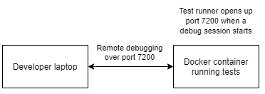
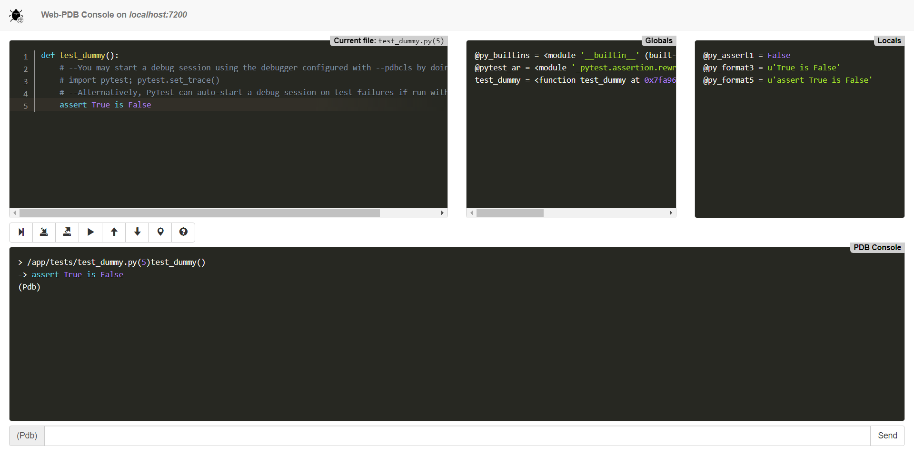
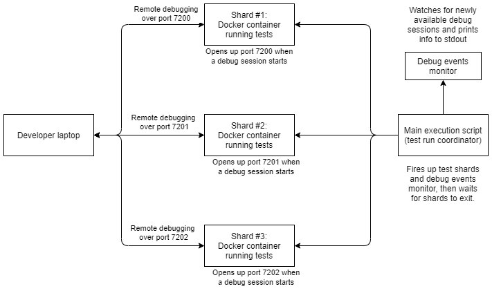

# Proof of concept - Debugging Python tests remotely: demo and practical usages

This repository contains a proof-of-concept (PoC) Python project that integrates PyTest
with public packages for remote debugging; for example,
[python-remote-pdb](https://github.com/ionelmc/python-remote-pdb) and
[python-web-pdb](https://github.com/romanvm/python-web-pdb).
The goal is to show that it's possible to debug Python tests failing in a continuous
integration (CI) environment, regardless of whether that's a good idea or not.
:slightly_smiling_face:

The project comes with a `Dockerfile` and Docker-based Bash scripts to easily fire up
the demo scenarios. The last demo scenario showcases a test execution architecture
with:

- (fake) test runner shards that independently open up ports for remote debugging, and
- a main execution script that reports newly available debug sessions while it waits
  for the test shards to finish.


## What you'll need to run this

- A recent version of Bash (e.g. `5.1.8`).
- A recent version of Docker Desktop and the Docker Engine (e.g. `3.5.0` and `20.10.7`).


## Problem statement

You have tests failures in CI and you cannot seem to reproduce them locally.
To make things worse, the tests only fail intermittently and error messages and tracebacks lead you nowhere.
What options do you have, besides witchery and clairvoyance, to learn more about the root cause?


## Why remote debugging may help

Failures like this are usually very hard to deal with because of the lack of reproducibility
and differences between Development and CI; and even if your environments aren't that
different, anti-patterns like global state and test interdependence can make reproducing
failures a nightmare.

While I'm aware that the things described above are signs of underlying problems that should be fixed,
sometimes, tackling a CI failure at hand cannot simply wait for the world to be a better place.
It is in these scenarios precisely where I believe remote debugging to be a tool of great value, as it'll
allow you to:

- Reliably step into a debug session right after an intermittent test failure occurs, and
- Debug in the environment where things fail, so no more guessing what went wrong with adhoc logging!


## Demo


### Build the project's Docker image

First, build the project's Docker image with:

```bash
./scripts/01-build-image.sh
```

We're going to use this image to spin up containers to (more or less) simulate remote test execution.

### Scenario #1: Single-instance test runner along `python-remote-pdb`

Demo scenario #1 showcases a test runner that opens up port 7200 for debugging whenever a test fails.
It relies on features built into PyTest and the `python-remote-pdb` package.



Run the demo with:
```bash
./scripts/02-remote-debugger.sh
```

You should see:
```
================================================================================ test session starts ================================================================================
platform linux2 -- Python 2.7.18, pytest-4.6.11, py-1.10.0, pluggy-0.13.1
rootdir: /app
collected 1 item                                                                                                                                                                    

tests/test_dummy.py F
>>>>>>>>>>>>>>>>>>>>>>>>>>>>>>>>>>>>>>>>>>>>>>>>>>>>>>>>>>>>>>>>>>>>>>>>>>>>>>>>>>>>> traceback >>>>>>>>>>>>>>>>>>>>>>>>>>>>>>>>>>>>>>>>>>>>>>>>>>>>>>>>>>>>>>>>>>>>>>>>>>>>>>>>>>>>>

    def test_dummy():
        # --You may start a debug session using the debugger configured with --pdbcls by doing:
        # import pytest; pytest.set_trace()
        # --Alternatively, PyTest can auto-start a debug session on test failures if run with the --pdb flag
>       assert True is False
E       assert True is False

tests/test_dummy.py:5: AssertionError
>>>>>>>>>>>>>>>>>>>>>>>>>>>>>>>>>>>>>>>>>>>>>>>>>>>>>>>>>>>>>>>>>>>>>>>>>>>>>>>>>>> entering PDB >>>>>>>>>>>>>>>>>>>>>>>>>>>>>>>>>>>>>>>>>>>>>>>>>>>>>>>>>>>>>>>>>>>>>>>>>>>>>>>>>>>>

>>>>>>>>>>>>>>>>>>>>>>>>>>>>>>>>>>>>>>>>>>>>>>>>>>>>>>>>>>>>>>>>>>>>> PDB post_mortem (IO-capturing turned off) >>>>>>>>>>>>>>>>>>>>>>>>>>>>>>>>>>>>>>>>>>>>>>>>>>>>>>>>>>>>>>>>>>>>>
2021-07-09 20:53:47,900: remote_pdb - remote_pdb:18 - CRITICAL - RemotePdb session open at 0.0.0.0:7200, waiting for connection ...
RemotePdb session open at 0.0.0.0:7200, waiting for connection ...
```

Notice how the last line states that a debug session is now waiting for connection on port `7200`.

In a separate terminal window, connect to the debug session with:
```bash
telnet localhost 7200
```

After connecting you should see:
```bash
Trying 127.0.0.1...
Connected to localhost.
Escape character is '^]'.
> /app/tests/test_dummy.py(5)test_dummy()
-> assert True is False
(Pdb)
```

Enter `c` in the Pdb prompt to continue; the test runner should exit.

This concludes this demo.


### Scenario #2: Single-instance test runner along `python-web-pdb`

Just like scenario #1, demo scenario #2 also showcases a test runner that opens up port 7200 for debugging whenever a test fails.
This time though, we rely on the `python-web-pdb` package for a nice web-based user interface.


Run the demo with:
```bash
./scripts/03-web-debugger.sh
```

You should see:
```
================================================================================ test session starts ================================================================================
platform linux2 -- Python 2.7.18, pytest-4.6.11, py-1.10.0, pluggy-0.13.1
rootdir: /app
collected 1 item                                                                                                                                                                    

tests/test_dummy.py F
>>>>>>>>>>>>>>>>>>>>>>>>>>>>>>>>>>>>>>>>>>>>>>>>>>>>>>>>>>>>>>>>>>>>>>>>>>>>>>>>>>>>> traceback >>>>>>>>>>>>>>>>>>>>>>>>>>>>>>>>>>>>>>>>>>>>>>>>>>>>>>>>>>>>>>>>>>>>>>>>>>>>>>>>>>>>>

    def test_dummy():
        # --You may start a debug session using the debugger configured with --pdbcls by doing:
        # import pytest; pytest.set_trace()
        # --Alternatively, PyTest can auto-start a debug session on test failures if run with the --pdb flag
>       assert True is False
E       assert True is False

tests/test_dummy.py:5: AssertionError
>>>>>>>>>>>>>>>>>>>>>>>>>>>>>>>>>>>>>>>>>>>>>>>>>>>>>>>>>>>>>>>>>>>>>>>>>>>>>>>>>>> entering PDB >>>>>>>>>>>>>>>>>>>>>>>>>>>>>>>>>>>>>>>>>>>>>>>>>>>>>>>>>>>>>>>>>>>>>>>>>>>>>>>>>>>>

>>>>>>>>>>>>>>>>>>>>>>>>>>>>>>>>>>>>>>>>>>>>>>>>>>>>>>>>>>>>>>>>>>>>> PDB post_mortem (IO-capturing turned off) >>>>>>>>>>>>>>>>>>>>>>>>>>>>>>>>>>>>>>>>>>>>>>>>>>>>>>>>>>>>>>>>>>>>>
2021-07-09 20:58:08,258: root - web_console:110 - CRITICAL - Web-PDB: starting web-server on 9867e34c017a:7200...
```

Notice how the last line states that a Web-PDB web server is now listening on port `7200`.

Using a web browser, navigate to:
```bash
http://localhost:7200
```

After connecting you should see:



Enter `c` in the Pdb prompt at the bottom to continue; the test runner should exit.

This concludes this demo.


### Scenario #3: Multi-instance ("sharded") test runner along `python-remote-pdb`

Demo scenario #3 showcases a test execution architecture with:

- three (fake) test runner shards that independently open up ports for remote debugging, and
- a main execution script that reports newly available debug sessions while it waits
  for the test shards to finish.

Each test shard opens up a different port for debugging whenever a test fails.
We rely on `python-remote-pdb` for console-based remote debugging.



Run the demo with:
```bash
./scripts/04-remote-debugger-with-test-shards.sh
```

You should initially see something like:
```
Starting test shard #1
Starting test shard #2
Starting test shard #3
Waiting for test shard #3 to finish...
```

After a few seconds, debug events should appear, stating that debug sessions are available for connection:
```
[MONITOR_DEBUG_EVENTS] Starting to monitor remote debugger events
[MONITOR_DEBUG_EVENTS] New remote debugger session available on port 7202
[MONITOR_DEBUG_EVENTS] New remote debugger session available on port 7201
[MONITOR_DEBUG_EVENTS] New remote debugger session available on port 7200
```

In separate terminal windows, connect to each shard with:
```bash
telnet localhost 7200
telnet localhost 7201
telnet localhost 7202
```

For each connection you should see:
```bash
Trying 127.0.0.1...
Connected to localhost.
Escape character is '^]'.
> /app/tests/test_dummy.py(5)test_dummy()
-> assert True is False
(Pdb)
```

Enter `c` in each Pdb prompt to continue. This should result in the exit of test runners, the debug events monitor and the main execution script:

```
Starting test shard #1
Starting test shard #2
Starting test shard #3
Waiting for test shard #3 to finish...
[MONITOR_DEBUG_EVENTS] Starting to monitor remote debugger events
[MONITOR_DEBUG_EVENTS] New remote debugger session available on port 7202
[MONITOR_DEBUG_EVENTS] New remote debugger session available on port 7201
[MONITOR_DEBUG_EVENTS] New remote debugger session available on port 7200
Done.
Waiting for test shard #2 to finish...
Done.
Waiting for test shard #1 to finish...
Done.
[MONITOR_DEBUG_EVENTS] Shutting down. Bye!
```

This concludes this demo.


## Known caveats

1. Currently, there's no way to specify a debug session timeout in order to avoid blocking test execution indefinitively when a developer doesn't connect.

2. The user interface from `python-web-pdb` hangs after the debug session ends, not letting developers know that session ended.


## Similar techniques

1. https://docs.celeryproject.org/en/v5.1.2/userguide/debugging.html describes how to debug Celery tasks remotely using `celery.contrib.rdb`, a Celery-owned implementation of remote debugging, similar to `python-remote-pdb`. This can be helpful when working in tasks locally, in cases where you don't want to resort to enabling [task_always_eager](https://docs.celeryproject.org/en/stable/userguide/configuration.html#std-setting-task_always_eager) to avoid execution environment discrepancies.

2. In https://www.codementor.io/@jorgecolon/remote-debugging-in-python-v1cbnej91, Jorge Colon explains how one may set up an application along either Visual Studio Code or PyCharm for remote debugging **in Production**. The packages shown in his article are different from the ones used in this proof of concept.
